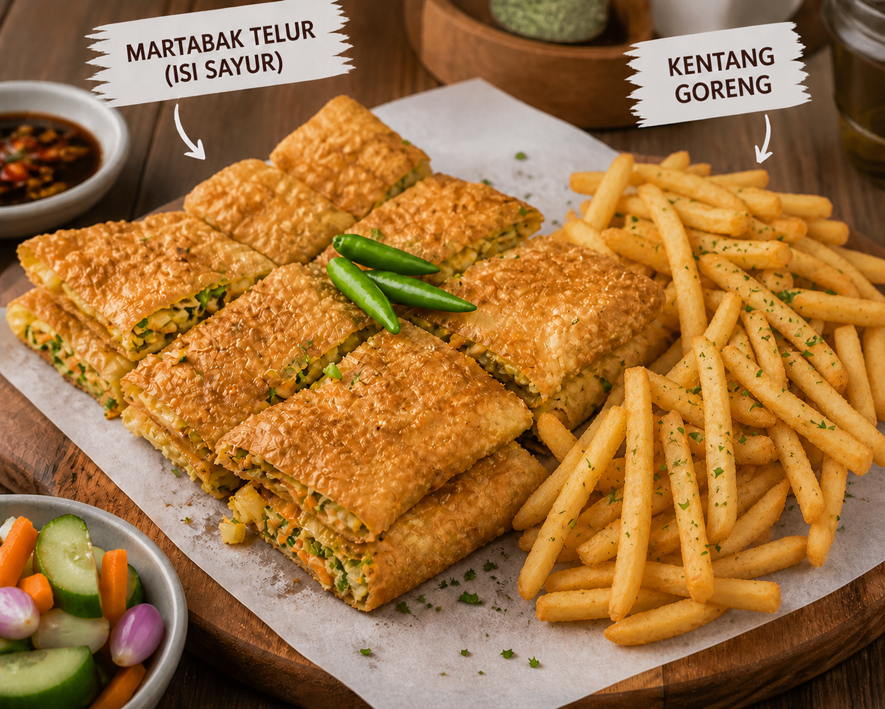
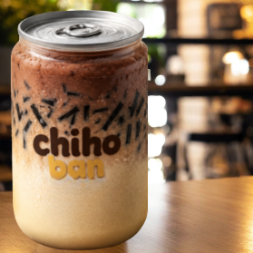
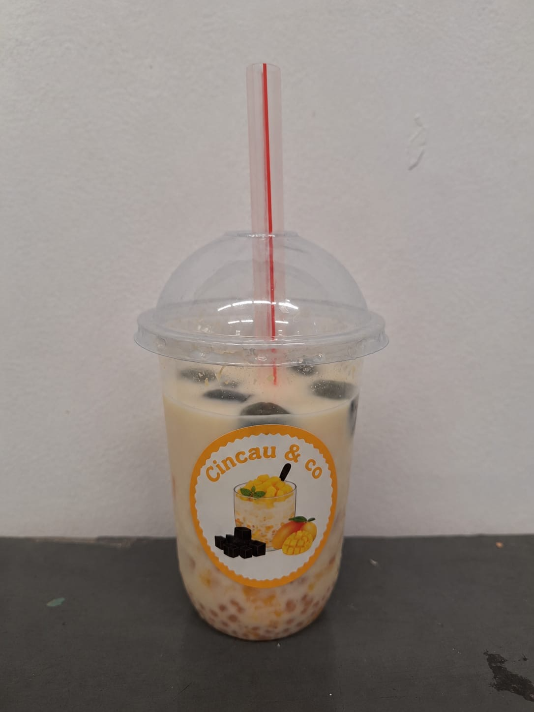

<!DOCTYPE html>
<html lang="id">
<head>
<meta charset="UTF-8">
<meta name="viewport" content="width=device-width, initial-scale=1.0">

<title>Event Bazar SMP IPEKA PLUIT</title>

</head>

<body>

<header>

<h1>Event Bazar SMP IPEKA PLUIT</h1>

</header>

<nav>
<button onclick="showPage('home')">Home</button>
<button onclick="showPage('ticket')">Booking Ticket</button>
<button onclick="showPage('seat')">Booking Seat</button>
<button onclick="showPage('food')">PO Makanan</button>
<button onclick="showPage('adminLogin')">Dashboard Admin</button>
</nav>

<!-- HOME -->

<h2>Welcome</h2>

Pesan tiket, seat, dan makanan digital.

<!-- ADMIN LOGIN -->

<h2>Login Dashboard Admin</h2>

<input type="text" id="adminUsername" placeholder="Username">

<input type="password" id="adminPassword" placeholder="Password">

<button class="main-btn" onclick="loginAdmin()">
Login
</button>

<!-- TICKET -->

<h2>Booking Ticket</h2>

<input type="text" id="ticketNama" placeholder="Nama">

<select id="ticketJenis">
<option value="25000">Regular - Rp25.000</option>
</select>

<input type="number" id="ticketJumlah" placeholder="Jumlah Ticket">

<button class="main-btn" onclick="bookingTicket()">
Pesan Ticket
</button>

<!-- SEAT -->

<h2>Booking Seat</h2>

<input type="text" id="seatNama" placeholder="Nama">

<button class="main-btn" onclick="bookingSeat()">
Booking Seat
</button>

<!-- FOOD -->

<h2>Pre-Order Makanan</h2>

<input type="text" id="foodNama" placeholder="Nama">

<!-- MARTATO -->

<h3>Martato</h3>

Rp17.000

<input type="number" id="martatoJumlah" placeholder="Jumlah">

<h4>Saus (Free)</h4>

<label class="option-row">
<input type="checkbox" class="martato-option" value="Tomat">
Tomat
</label>

<label class="option-row">
<input type="checkbox" class="martato-option" value="Cabe">
Cabe
</label>

<h4>Toppings</h4>

<label class="option-row">
<input type="checkbox" class="martato-option" value="BQQ">
BQQ (+1k)
</label>

<label class="option-row">
<input type="checkbox" class="martato-option" value="Keju">
Keju (+1k)
</label>

<h4>Add On</h4>

<label class="option-row">
<input type="checkbox" id="mozarellaAddOn">
Mozzarella (+3k)
</label>

<button onclick="tambahMartato()">
Tambah
</button>

<!-- CHIHOBAN -->

<h3>Chihoban</h3>

Rp16.000

<input type="number" id="chihobanJumlah" placeholder="Jumlah">

<h4>Toppings (Free)</h4>

<label class="option-row">
<input type="checkbox" class="chihoban-option" value="Oreo Crumble">
Oreo Crumble
</label>

<label class="option-row">
<input type="checkbox" class="chihoban-option" value="Regal Crumble">
Regal Crumble
</label>

<h4>Add On</h4>

<label class="option-row">
<input type="checkbox" id="bobaAddOn">
Boba (+2k)
</label>

<label class="option-row">
<input type="checkbox" id="eskrimAddOn">
Es Krim (+3k)
</label>

<button onclick="tambahChihoban()">
Tambah
</button>

<!-- CINCAU -->

<h3>Cincau & Co</h3>

Rp15.000

<input type="number" id="cincauJumlah" placeholder="Jumlah">

<button onclick="tambahMenu('Cincau & Co',15000,'cincauJumlah')">
Tambah
</button>

<h3>Keranjang Pesanan</h3>

<h3>Total: Rp0</h3>

<button class="main-btn" onclick="orderFood()">
Pesan Semua
</button>

<h3>Scan QRIS</h3>

<!-- ADMIN -->

<h2>Dashboard Admin</h2>

Total Ticket: 0

Total Seat: 0

Total Food: 0

<input
type="text"
id="searchOrder"
class="search-box"
placeholder="Cari nama..."
onkeyup="searchOrder()"
>

<h3>Pesanan Masuk</h3>

</body>
</html>
